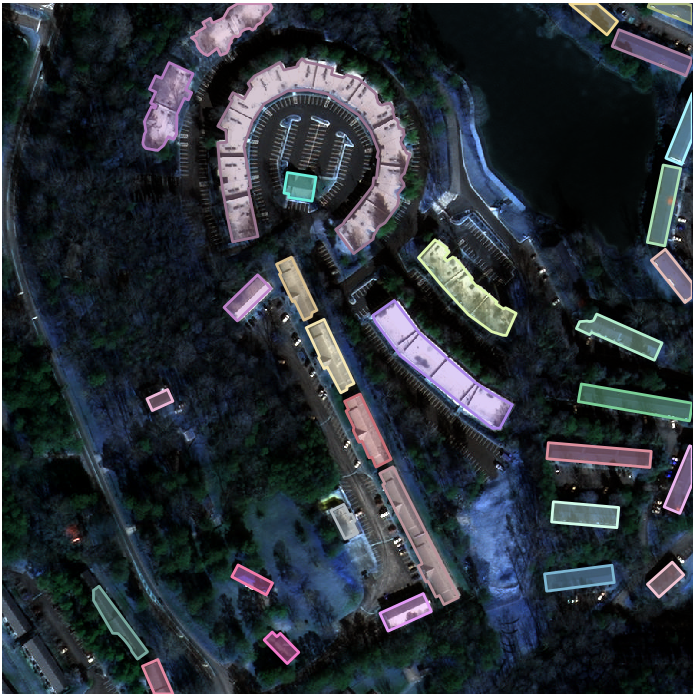
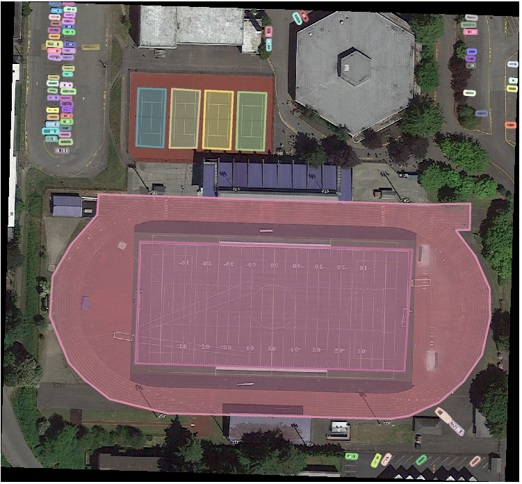
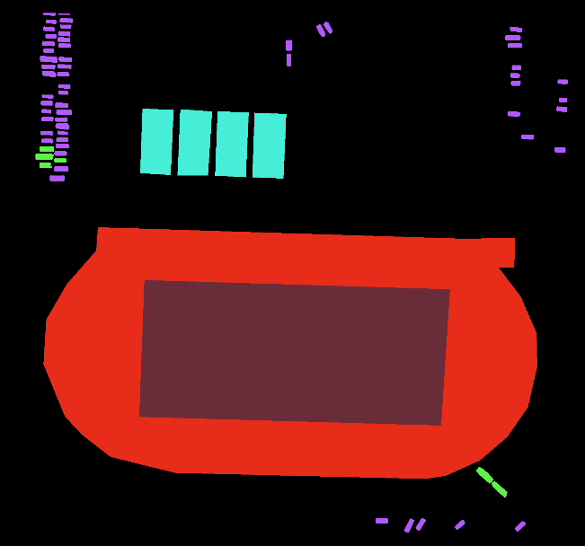

# COCO-Assistant 


[](https://github.com/psf/black)
[](https://pypi.org/project/coco-assistant/)
[](https://img.shields.io/github/license/ashnair1/COCO-Assistant?color=yellow&label=License&logo=MIT)

Helper for dealing with MS-COCO annotations.

## Overview
The MS COCO annotation format along with the pycocotools library is quite popular among the computer vision community. Yet I for one found it difficult to play around with the annotations. Deleting a specific category, combining multiple mini datasets to generate a larger dataset, viewing distribution of classes in the annotation file are things I would like to do without writing a separate script for each. The COCO Assistant is designed (or being designed) to assist with this problem. **Please note that currently, the Assistant can only help out with object detection datasets**. Any contributions and/or suggestions are welcome.

### Requirements
Your data directory should look as follows:

```markdown
Example:
.
├── images
│   ├── train
│   ├── val
|   ├── test
|   
├── annotations
│   ├── train.json
│   ├── val.json
│   ├── test.json

``` 

## Installation

### 1. Installation: pip </br>

`pip install coco-assistant`

### 2. Installation: From Source
```markdown
# Clone the repository
git clone https://github.com/ashnair1/COCO-Assistant.git
# Build and install the library
make
```

## Usage

Usage is similar to how you would use `pycocotools`

```markdown
from coco_assistant import COCO_Assistant

# Specify image and annotation directories
img_dir = os.path.join(os.getcwd(), 'images')
ann_dir = os.path.join(os.getcwd(), 'annotations')

# Create COCO_Assistant object
cas = COCO_Assistant(img_dir, ann_dir)
```
## Package features

### 1. Merge datasets

The `merge` function allows you to merge multiple datasets.

```markdown
In[1]: cas = COCO_Assistant(img_dir, ann_dir)                                                                                                                                                              
loading annotations into memory...
Done (t=0.09s)
creating index...
index created!
loading annotations into memory...
Done (t=0.06s)
creating index...
index created!

In[2]: cas.merge(merge_images=True)                                                                                                                                                                                       
Merging image dirs
100%|█████████████████████████████████████████████████████████████████████| 2/2 [00:00<00:00, 18.33it/s]
Merging annotations
100%|█████████████████████████████████████████████████████████████████████| 2/2 [00:00<00:00, 14.72it/s]

```
The merged dataset (images and annotation) can be found in `./results/combination`

### 2. Remove categories

Removes a specific category from an annotation file.

```markdown
In[1]: cas = COCO_Assistant(img_dir, ann_dir)                                                                                                                                                              
loading annotations into memory...
Done (t=0.09s)
creating index...
index created!
loading annotations into memory...
Done (t=0.06s)
creating index...
index created!
 
# In interactive mode
In[2]: cas.remove_cat(interactive=True)
['tiny.json', 'tiny2.json']
Who needs a cat removal?
tiny.json

Categories present:
['building', 'vehicles']

Enter categories you wish to remove as a list:
['building']
Removing specified categories...

# In non-interactive mode
In[3]: cas.remove_cat(interactive=False, jc="tiny.json", rcats=['building'])
Removing specified categories...
```
The modified annotation can be found in `./results/removal`

### 3. Generate annotation statistics

1.  Generate countplot of instances per category that occur in the annotation files. 
 `cas.ann_stats(stat="area",arearng=[10,144,512,1e5],save=False)`

2.  Generate pie-chart that shows distribution of objects according to their size (as specified in areaRng). 
 `cas.ann_stats(stat="cat", show_count=False, save=False)`

### 4. Visualise annotations

Couldn't `pycocotools` visualise annotations (via [showAnns](https://github.com/cocodataset/cocoapi/blob/636becdc73d54283b3aac6d4ec363cffbb6f9b20/PythonAPI/pycocotools/coco.py#L233)) as well? Sure it could, but I required a way to freely view all the annotations of a particular dataset so here we are.

```markdown
In[1]: cas.visualise()
Choose directory:
['tiny', 'tiny2']
tiny
```


### 5. Generate segmentation masks
The `cas.get_segmasks()` function allows you to create segmentation masks from your MS COCO object detection datasets. Similar to the Pascal VOC dataset, the mask values are their classes and a colour palette is applied to enable visualisation. The generated masks are stored in the `./results` folder. Samples are shown below.

|                |                            Detection                                             |                                               Segmentation                                       |   
|----------------|----------------------------------------------------------------------------------|--------------------------------------------------------------------------------------------------|
| **SpaceNet**   |    |     |
| **iSAID**      |             |              |

